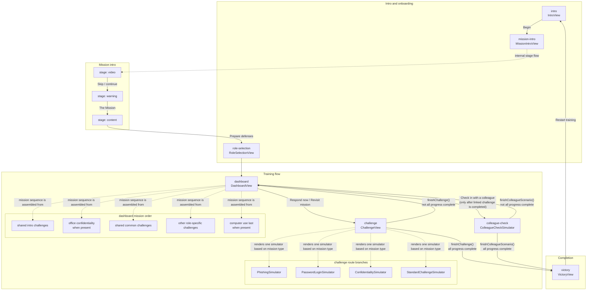

# App Navigation Diagram

## Notes

- `challenge` is a container route that renders one of several simulators based on the active mission type.
- `colleague-check` becomes available from the dashboard after the linked challenge is completed.
- `mission-intro` is one app view with three internal stages: `video`, `warning`, and `content`.
- `victory` depends on total progress completion across both missions and colleague checks.
